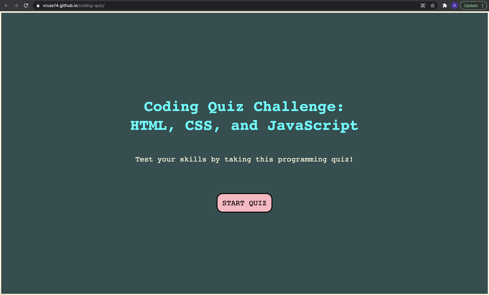

# Coding Quiz

## Description

The purpose of this project was to design a functional multiple choice quiz about coding. As the user answers questions, the page transitions to the next question. When the quiz is over or when the timer is at zero, the game is over and the user can input his or her initials and save a high score. These scores are in local storage, so that the user can view previous scores again even after the page has been refreshed.

I initially began the project by creating a function for each question, then realized that a better approach was to create question bank with an array of objects. This makes the code easier to maintain, and it makes it much simpler to navigate between questions.

I ran into scoping issues while creating the project, but also ran into several errors while saving and displaying high scores in local storage. I gained a deeper appreciation for JSON.stringify, JSON.parse, and the push method because it was much easier to add and iterate over an array than a single string. I also learned about several new errors, including why functions could return as "null." 

Overall, although this was a challenging project, I gained new insights as I built each component of the application's functionality. I especially enjoyed coming up with questions, because it helped me reflect on lessons I have learned so far during the beginning of my journey as a web developer.

In the future, I would like to add additional features to this quiz, including:

- Multiple sets of questions so that the computer randomly selects one set of questions for the user

- Questions being presented in a randomized order

- A progress bar that illustrates how far the user is in the quiz

- Questions that include a section of code with answer options to indicate if the code will run with no errors, or if it runs with an error, what kind of error it would be

Please find the deployed application here: https://vruss14.github.io/coding-quiz/

## Installation

No installation steps are required to view this project. To view the front-end application, visit the URL above. The application's source code can be found on GitHub here: https://github.com/vruss14/coding-quiz.

## Usage

This web application includes responsive design and can be viewed on all devices.

Below is a screenshot of the deployed application:

## Credits

Valerie Russell built the HTML, CSS, and JavaScript for the application's functionality. She also wishes to thank the learning assistant team on Bootcamp Spot for their valuable insights to her questions.